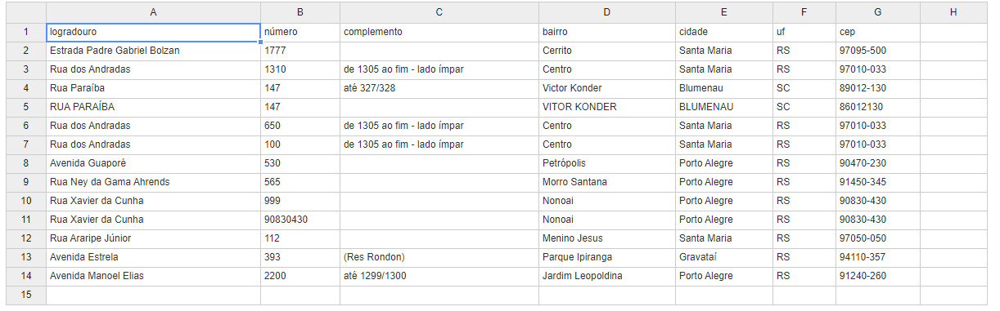

### Alunos:
* Gabriel Kresin
* Iago G. Tambosi
* Jonas F. Schuh

### Tarefa 4: Pré-processamento de texto e extração das informações
Utilizando a base de dados data_endereco.txt, realizar pré-processamento de texto e extração das informações:

- logradouro
- nro
- complemento
- bairro
- cidade
- uf
- cep

Gere um arquivo .CSV com os campos

Resultado da execução do script:

